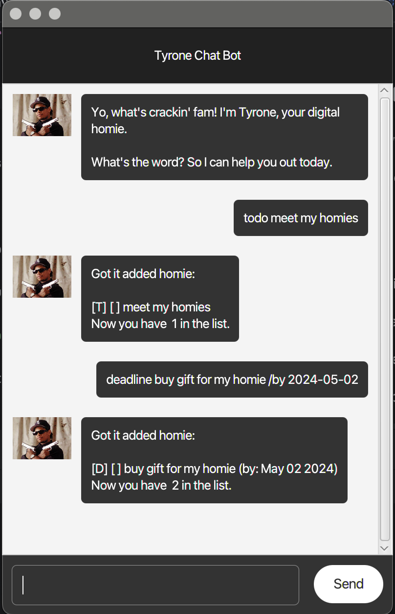

# Tyrone Chatbot User Guide

**Preview**



**About**

Introducing Tyrone, your ultimate task management chatbot companion. Say goodbye to scattered to-do lists and missed 
deadlines. With Tyrone by your side, effortlessly organize your tasks, set reminders, and stay on top of your schedule, 
all through simple conversation. Whether you're juggling work projects, personal errands, or a mix of both, 
Tyrone streamlines your productivity, offering personalized assistance tailored to your needs. Experience seamless task 
management like never before with Tyrone.

Tyrone supports three main types of tasks: todo, deadline & event.

## Features

### Adding Todos
Adds a simple task into the task list.

**Command Format**: ```todo <task description>```
* **task description** - the name of the todo task.

**Example**: add a "meet my homies" todo into the list.
```todo meet my homies```

### Adding deadlines

Adds a task with a due date time into the task list.

**Command Format**: ```deadline <task description> /by <yyyy-mm-dd[ HH:mm]>```

* **task description** - the name of the deadline task.
* **yyyy-mm-dd** - the due date of the deadline.
* **HH:mm** - (optional) due time of the deadline.

**Example**: add a "submit assignment" deadline with due date without time. ```deadline submit assignment /by 2024-05-04``` 
and with time ```deadline submit assignment /by 2024-05-04 14:00```

### Adding events

Adds a task with a duration date time into the list.

**Command Format**: ```event <description> /from <yyyy-mm-dd[ HH:mm]> /to <yyyy-mm-dd[ HH:mm]>```

* **task description** - the name of the event task.
* **yyyy-mm-dd** - the from/to date of the event.
* **HH:mm** - (optional) from/to time of the event.

**Example**: add a "eat with homies" deadline with from/to date without time. ```event eat with homies /from 2024-05-04 /to 2024-05-05```
and with from/to time ```event eat with homies /from 2024-05-04 14:00 /to 2024-05-05 15:00```

### View task list

Displays the current task list of the application.

**Command Format**: ```list```

### Mark task as done

Mark a specific task as considered done.

**Command Format**: ```mark <task id>```

* **task id** - the id of the task to be marked with respect to the task list viewable by `list` command. It must be 1 <= task id <= task list size.

**Example**: marks the task with id 1 ```mark 1```

### Unmark task as done

Unmark a specific task to be not done.

**Command Format**: ```unmark <task id>```

* **task id** - the id of the task to be unmarked with respect to the task list viewable by `list` command. It must be 1 <= task id <= task list size.

**Example**: marks the task with id 1 ```unmark 1```

### Delete task

Delete a specific task from the list.

**Command Format**: ```delete <task id>```

* **task id** - the id of the task to be deleted with respect to the task list viewable by `list` command. It must be 1 <= task id <= task list size.

**Example**: delete the task with id 1 ```delete 1```

### Find task with keyword

Find list of tasks from the list with the specified keyword substring.

**Command Format**: ```find <keyword>```

* **keyword** - the keyword substring to be used to search.

**Example**: finds all the task with "submit" substring in its task description ```find submit```

### Undo

Undo the recent commands the user made e.g. add, mark, unmark, delete.

**Command Format**: ```undo```

### Exit application

Terminates the application.

**Command Format**: ```bye```

## How to use

1. Download latest jar file release from the [repo](https://github.com/jmsandiegoo/ip/releases).
2. Double-click the jar file to run the application.
3. Enjoy Tyrone's company.

## To run locally
Needs JDK 11, update Intellij to the most recent version.
1. Clone the repo locally
2. Open the repo with chosen ide that has gradle.
3. Run gradlew command `./gradlew clean run`